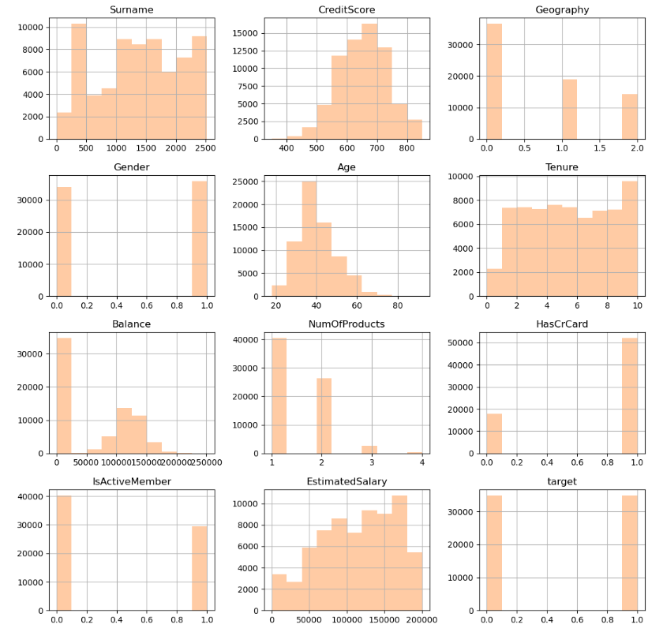
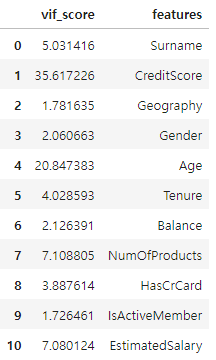
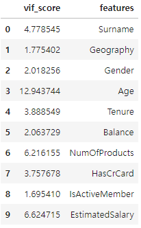
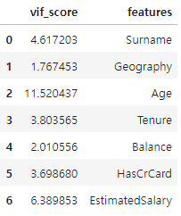
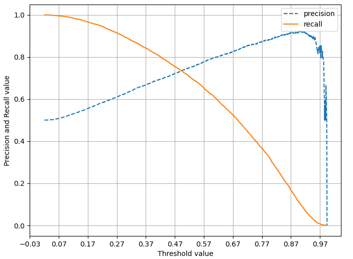
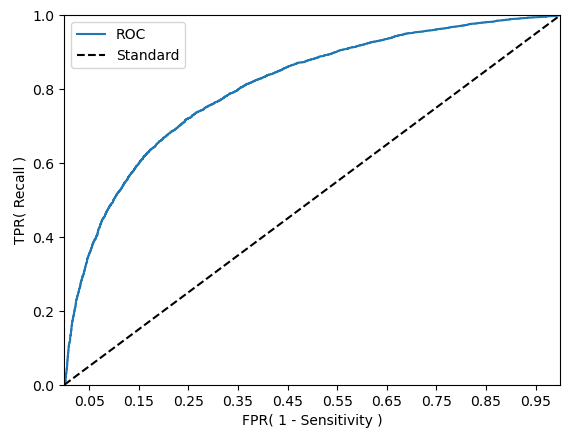

# **은행 고객 이탈 예측**

> **Surname** 레이블로 인코딩된 고객의 성씨  
> **CreditScore** 고객의 신용점수  
> **Geography** 국가  
> **Gender** 성별  
> **Age** 나이  
> **Tenure** 은행을 사용한 연도  
> **Balance** 고객의 계좌 잔액  
> **NumOfProducts** 고객이 사용한 은행 상품 수  
> **HasCrCard** 고객의 신용보유 여부 카드 (1=True, 0=False)  
> **IsActiveMember** 고객이 활성 회원인지 여부  
> **EstimatedSalary** 고객의 예상 급여

> **Exited** 고객이 이탈했는지 여부 (1=True, 0=False)

## **📌목차**

1. 데이터 확인 및 전처리
2. 타겟 데이터 언더샘플링
3. 이상치 제거
4. 다중공선성 해소
5. 차원 축소
6. classifier 모델을 사용한 분류 예측 (적절한 모델 선정)
7. Threshold(임계값)을 조정하여 정밀도와 재현율 조정 및 시각화
8. 교차검증을 통한 과적합 여부 확인
9. 결과

## **📊 데이터 전처리**

데이터의 중복행, 결측치가 존재하지 않았습니다.

불필요한 인덱스 컬럼`id`, `CustomerId`을 삭제하였습니다.  
`Exited` 컬럼을 타겟 데이터로 설정한 후 언더샘플링을 통해 데이터 비중을 동일하게 조정하였습니다.  
`Surname`, `Geography`, `Gender` 문자열의 범주형인 컬럼을 LabelEncoder를 통해 정수로 변환하였습니다.

전처리 후 히스토그램을 통해 데이터의 값을 확인 했습니다.

 

Balance 에 0인 값이 많고, 범주형 데이터의 값의 분포가 고르지 않음을 확인할 수 있었습니다.

## **📊 1Cycle 결과**

#### Target 의 값을 언더샘플링한 데이터로 LogisticRegression 모델을 통해 학습을 진행하였습니다.

> **정확도: 0.6850, 정밀도: 0.6847, 재현율: 0.6857, F1:0.6852, AUC:0.6850**

## **📊 2Cycle 결과**

#### 수치형 데이터 `CreditScore`, `Age`, `Balance`, `EstimatedSalary` 의 이상치를 제거한 후 LogisticRegression 모델을 통해 학습을 진행하였습니다.

> **정확도: 0.6929, 정밀도: 0.6880, 재현율: 0.6908, F1:0.6894, AUC:0.6928**

1Cycle 보다 전체적인 수치가 소폭 상승한 결과를 볼 수 있습니다.

## **📊 3Cycle 결과**

#### `OLS`와 `VIF`를 통해 수치를 확인하고 다중공선성을 해소해보았습니다.

0.  제거하기 전,

 

1.  `CreditScore` 컬럼을 제거하였을 때,

 

> 정확도: 0.6352, 정밀도: 0.6144, 재현율: 0.7001, F1:0.6544, AUC:0.6360

2.  `IsActiveMember`, `NumOfProducts`, `Gender` 컬럼을 제거하였을 때,

 

> 정확도: 0.6179, 정밀도: 0.5981, 재현율: 0.6879, F1:0.6399, AUC:0.6189

아래로 갈 수록 다중공선성이 다소 해소된 모습입니다.  
하지만 OLS와 LogisticRegression 모델의 결과를 비교하였을 때,  
1의 경우가 다중공선성을 해소하면서 성능이 좋은 모델이라 판단되어 1의 데이터를 사용하도록 합니다.

## **📊 4Cycle 결과**

#### 차원축소를 진행한 후, Classifier 모델을 사용하여 가장 성능이 좋은 모델을 찾아봅니다.

            DTC 정확도: 0.7362, 정밀도: 0.7458, 재현율: 0.7166, F1:0.7309, AUC:0.7362
            SVC 정확도: 0.7362, 정밀도: 0.7458, 재현율: 0.7166, F1:0.7309, AUC:0.7362
            KNN 정확도: 0.7125, 정밀도: 0.7197, 재현율: 0.6960, F1:0.7077, AUC:0.7125
            RFC 정확도: 0.7346, 정밀도: 0.7495, 재현율: 0.7045, F1:0.7263, AUC:0.7346
            Hard Voting 정확도: 0.7360, 정밀도: 0.7436, 재현율: 0.7202, F1:0.7317, AUC:0.7360
            Soft Voting 정확도: 0.7360, 정밀도: 0.7436, 재현율: 0.7202, F1:0.7317, AUC:0.7360
            AdaBoost 정확도: 0.7333, 정밀도: 0.7555, 재현율: 0.6897, F1:0.7211, AUC:0.7333
            GBC 정확도: 0.7349, 정밀도: 0.7443, 재현율: 0.7156, F1:0.7297, AUC:0.7349
            XGBoost 정확도: 0.7345, 정밀도: 0.7483, 재현율: 0.7066, F1:0.7269, AUC:0.7345
            LightGBM 정확도: 0.7334, 정밀도: 0.7434, 재현율: 0.7128, F1:0.7278, AUC:0.7334
            LogisticRegression 정확도: 0.7362, 정밀도: 0.7458, 재현율: 0.7166, F1:0.7309, AUC:0.7362

> F1 스코어의 값이 좋으면서 정확도가 높은 LogisticRegression이 가장 적절하다고 판단하였습니다.

#### Threshold(임계값)을 조정하여 정밀도와 재현율 조정해봅니다.

           해당 모델은 은행 고객의 이탈을 예측하여 이탈을 방지하는 목적으로 만들어지는 모델입니다.

           TP: 이탈할 고객을 이탈할 고객으로 올바르게 분류한 경우
           FP: 이탈하지 않을 고객을 이탈할 고객으로 잘못 분류한 경우
           TN: 이탈하지 않을 고객을 이탈하지 않을 고객으로 올바르게 분류한 경우
           FN: 이탈할 고객을 이탈하지 않을 고객으로 잘못 분류한 경우

           정밀도: 이탈할 고객으로 예측한 고객중에서 실제로 이탈한 고객의 비율을 나타낸다.
           즉, 음성으로 예측한 결과중 얼마나 많은것이 음성인지 측정한다.

           재현율: 실제로 이탈한 고객중에서 이탈 고객으로 정확하게 예측한 고객의 비율을 나타낸다.
           즉, 얼마나 많은 고객을 놓치지않고 감지했는지 측정한다.

           해당 모델은 이탈 고객을 예측하여 이탈을 방지하는 목적으로 만들어지는 모델이라고 가정할 때,
           모델이 이탈할 고객을 이탈하지 않을 고객으로 잘못 분류하여 놓치는 경우(FN) 은행의 고객 유지에 좋지 않다.
           때문에 FN을 낮추기 위해 임계치를 낮추고 재현율을 올려주는 것이 적절하다고 판단한다.

-   다음은 임계치를 조정하여 LogisticRegression 모델을 사용한 결과입니다.
    > 정확도: 0.7252, 정밀도: 0.6988, 재현율: 0.7917, F1:0.7423, AUC:0.7253

  

#### k-Fold를 통하여 교차검증하여 해당 모델의 과적합을 확인해봅니다.

> 교차 검증시 정확도 : 0.7372
> 실제 예측 정확도 : 0.7351

과적합이 아님을 판단할 수 있었습니다.
