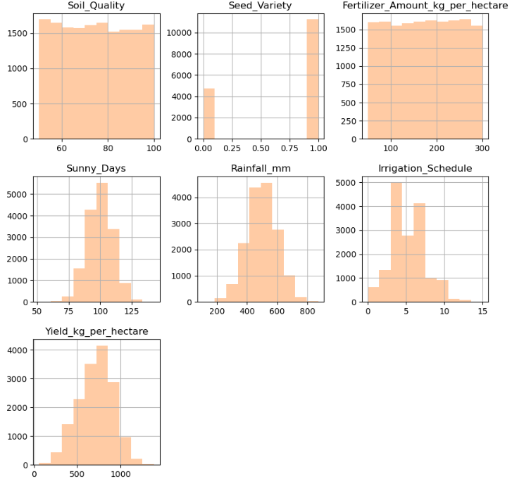
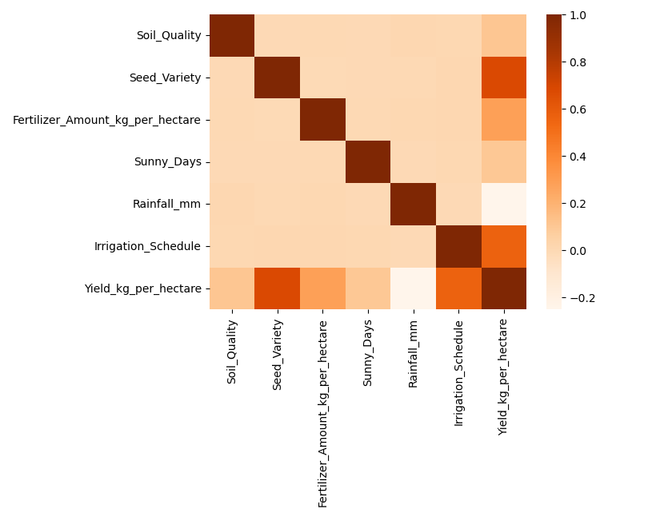
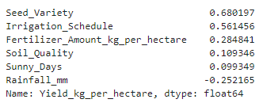
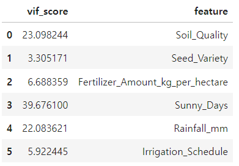
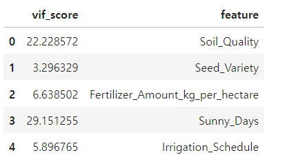
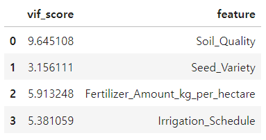
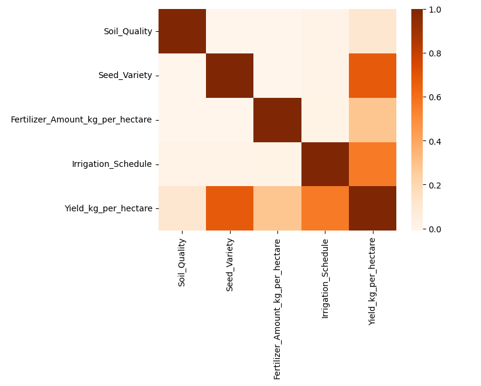
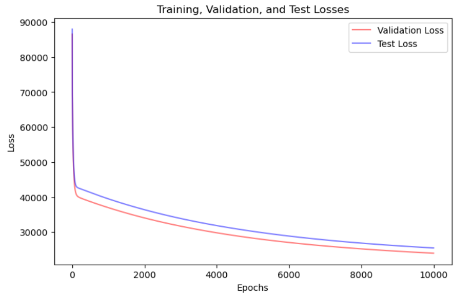
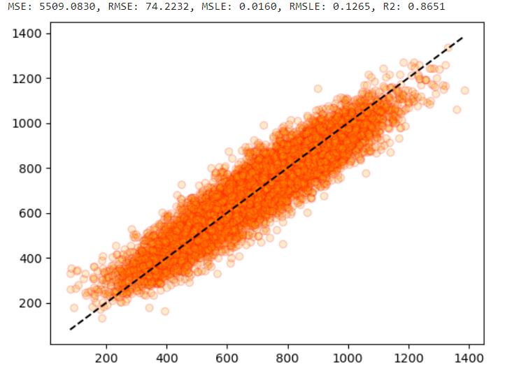
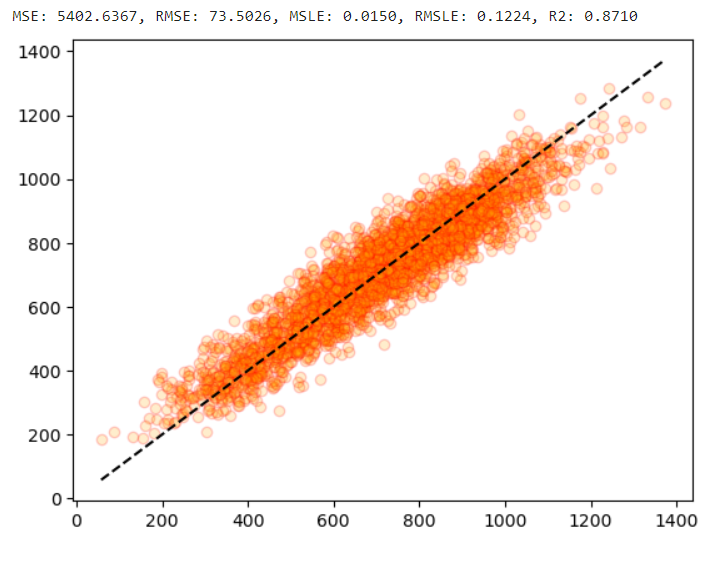

# **농업 수확량 예측 데이터**

> **Soil_Quality** 토양 품질  
> **Seed_Variety** 씨앗 종류  
> **Fertilizer_Amount_kg_per_hectare** 비료 양 (hectare 당 kg)  
> **Sunny_Days** 맑은 날 수  
> **Rainfall_mm** 강수량 (mm)  
> **Irrigation_Schedule** 관개 일정  
> **Yield_kg_per_hectare** 수확량 (hectare 당 kg)

## **📌목차**

1. 데이터 확인 및 전처리
2. 선형 회귀 분석
3. 다항 회귀 분석
4. 트리 기반 회귀 모델을 사용한 회귀 분석
5. 교차 검증 및 Pytorch를 통한 loss 변화 시각화
6. 과적합 확인

## **📊 데이터 전처리**

데이터의 중복행, 결측치가 존재하지 않았습니다.  
히스토그램을 통해 데이터를 확인해봅니다.

## **📊 1Cycle 결과**

#### 전처리 없이 회귀 분석 모델을 사용해봅니다.

선형 회귀 분석 결과

> MSE: 2536.0684, RMSE: 50.3594, MSLE: 0.0071, RMSLE: 0.0843, R2: 0.9395

다항 회귀 분석 결과

> MSE: 2578.7882, RMSE: 50.7818, MSLE: 0.0074, RMSLE: 0.0862, R2: 0.9385

        회귀 분석 결과 R2 값이 대체적으로 높으며 LinearRegression 모델의 결과가 조금 더 높으므로 선형 데이터의 형태를 띤다고 볼 수 있습니다.
        R2가 0.9395 의 수치로 과적합의 위험이 있을 수 있다고 판단하여 데이터를 다시 전처리해봅니다.

## **📊 2Cycle 결과**

#### Target 데이터를 제외한 피처들을 StandardScaler 를 통해 정규화한 다음 이상치를 제거해봅니다.

#### 트리를 기반으로한 다섯 가지의 회귀 모델을 추가로 사용하여 모델간 결과를 비교해봅니다.

선형 회귀 분석 결과

> MSE: 2532.9262, RMSE: 50.3282, MSLE: 0.0072, RMSLE: 0.0848, R2: 0.9318

다항 회귀 분석 결과

> MSE: 2508.3455, RMSE: 50.0834, MSLE: 0.0068, RMSLE: 0.0824, R2: 0.9307

DecisionTreeRegressor

> MSE: 5684.6010, RMSE: 75.3963, MSLE: 0.0160, RMSLE: 0.1266, R2: 0.8470

RandomForestRegressor

> MSE: 3005.1370, RMSE: 54.8191, MSLE: 0.0087, RMSLE: 0.0935, R2: 0.9191

GradientBoostingRegressor

> MSE: 2696.3186, RMSE: 51.9261, MSLE: 0.0078, RMSLE: 0.0886, R2: 0.9274

XGBRegressor

> MSE: 2978.5480, RMSE: 54.5761, MSLE: 0.0086, RMSLE: 0.0925, R2: 0.9198

LGBMRegressor

> MSE: 2718.2718, RMSE: 52.1370, MSLE: 0.0079, RMSLE: 0.0890, R2: 0.9268

        이상치를 제거함으로써 더 일반화되고 신뢰도가 높은 모델이라고 판단할 수 있습니다.
        전처리 전보다 수치가 아주 조금 하락하였으나 여전히 높은 결과를 가지고 있습니다.

## **📊 3Cycle 결과**

#### 독립, 종속변수간의 상관관계와 OLS, VIF를 확인하여 다중공선성을 제거해봅니다.

변수간의 상관관계  
 

타겟과의 상관관계  
 

1. 컬럼 제거 전  
   

    > MSE: 2532.9262, RMSE: 50.3282, MSLE: 0.0072, RMSLE: 0.0848, R2: 0.9318

2. `Rainfall_mm` 컬럼 제거  
   

    > MSE: 5077.0234, RMSE: 71.2532, MSLE: 0.0143, RMSLE: 0.1194, R2: 0.8788

3. `Sunny_Days` 컬럼 제거  
   
    > MSE: 5401.9247, RMSE: 73.4978, MSLE: 0.0150, RMSLE: 0.1224, R2: 0.8710

(좌) 다중공선성 해소 전 / (우) 다중공선성 해소 후 상관관계 시각화  

        R2의 값이 소폭 줄어들었지만 OLS 와 VIF 결과 다중공선성이 해소된 더 좋은 모델이 되었다고 할 수 있습니다.

LinearRegression

> MSE: 5401.9247, RMSE: 73.4978, MSLE: 0.0150, RMSLE: 0.1224, R2: 0.8710

DecisionTreeRegressor

> MSE: 11172.5546, RMSE: 105.7003, MSLE: 0.0305, RMSLE: 0.1746, R2: 0.7333

RandomForestRegressor

> MSE: 6507.0297, RMSE: 80.6662, MSLE: 0.0181, RMSLE: 0.1344, R2: 0.8447

GradientBoostingRegressor

> MSE: 5522.8960, RMSE: 74.3162, MSLE: 0.0155, RMSLE: 0.1246, R2: 0.8682

XGBRegressor

> MSE: 6045.7488, RMSE: 77.7544, MSLE: 0.0169, RMSLE: 0.1300, R2: 0.8557

LGBMRegressor

> MSE: 5597.5747, RMSE: 74.8169, MSLE: 0.0157, RMSLE: 0.1254, R2: 0.8664

        회귀 모델 중 LinearRegression 의 성능이 가장 좋으므로 LinearRegression 을 사용하는 것이 가장 적합합니다.

#### 과적합 여부를 확인해봅니다.

1. `cross_val_score`를 통해 훈련 데이터를 교차검증 해봅니다.

> 훈련 평균 0.8647  
> 실제 예측 0.8710

        과적합의 위험이 적다고 판단하였습니다.

2. `Pytorch`를 통해 직접 나눈 검증데이터를 훈련하고 loss 값을 시각화 해봅니다.

        epoch 의 수치가 9,000,000 까지 조금씩 loss 값이 줄어들지만 10,000 이후부터는 변화가 적어 10,000까지 시각화한 모습입니다.
        훈련 결과 Validation과 test 둘 다 loss 변화가 비슷하고 0에 수렴하는 모습입니다.
        결론으로는 과적합이 발생하지 않았다고 판단할 수 있습니다.

3. LinearRegression 모델의 회귀 예측 결과를 시각화하여 규제가 필요한지 판단해봅니다.

> 훈련 결과 R2: 0.8651
> 실제 예측 R2: 0.8710

        훈련 결과와 실제 예측 결과가 거의 비슷한 양상을 보이며 수치도 차이가 나지 않습니다.
        때문에 규제를 따로 주지 않아도 과적합이 발생하지 않은 성능이 좋은 모델이라 판단할 수 있습니다.
