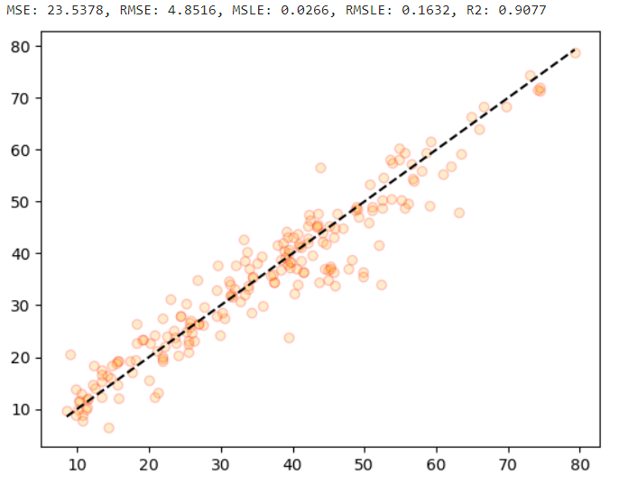

# **콘크리트 압축 강도**

> **Cement** 시멘트  
> **Blast Furnace Slag** 고로슬래그  
> **Fly Ash** 플라이 애시  
> **Water** 물  
> **Superplasticizer** 고분자 감수제  
> **Coarse Aggregate** 거친 골재  
> **Fine Aggregate** 미세 골재  
> **Age (day)** 시편이 형성된 후 경과한 시간

> **Concrete compressive strength** 콘크리트 압축 강도

## **📌목차**

1. 데이터 확인 및 전처리
2. 선형 회귀 분석
3. 다항 회귀 분석
4. 트리 기반 회귀 모델을 사용한 회귀 분석
5. OLS, VIF 다중공선성 해소
6. 과적합 확인

## **📊 데이터 전처리**

데이터의 중복행은 25행으로 제거하였으며, 결측치는 존재하지 않았습니다.  
히스토그램을 통해 데이터를 확인해봅니다.

## **📊 1Cycle 결과**

#### 전처리를 하지 않고 모델을 학습시켜봅니다.

선형 회귀 분석 결과

> MSE: 116.2104, RMSE: 10.7801, MSLE: 0.1057, RMSLE: 0.3250, R2: 0.5442

다항 회귀 분석 결과

> MSE: 58.4785, RMSE: 7.6471, MSLE: 0.0624, RMSLE: 0.2498, R2: 0.7770

DecisionTreeRegressor

> MSE: 36.8723, RMSE: 6.0723, MSLE: 0.0425, RMSLE: 0.2063, R2: 0.8554

RandomForestRegressor

> MSE: 21.9056, RMSE: 4.6803, MSLE: 0.0231, RMSLE: 0.1518, R2: 0.9141

GradientBoostingRegressor

> MSE: 22.1132, RMSE: 4.7025, MSLE: 0.0239, RMSLE: 0.1546, R2: 0.9133

XGBRegressor

> MSE: 14.9316, RMSE: 3.8641, MSLE: 0.0177, RMSLE: 0.1332, R2: 0.9414

LGBMRegressor

> MSE: 17.0718, RMSE: 4.1318, MSLE: 0.0213, RMSLE: 0.1461, R2: 0.9330

         선형 회귀 모델보다 다항 회귀 모델의 결과가 좋으며 비선형 데이터에 가깝다고 할 수 있습니다.
         또한 다항 회귀 모델을 사용하였을 때 degree는 2가 가장 높았습니다.

         트리 모델중 가장 성능이 좋은 모델은 XGBRegressor 입니다.

## **📊 2Cycle 결과**

#### 독립, 종속변수간의 상관관계와 OLS, VIF를 확인해봅니다.

         전체적으로 높진 않지만 종속변수간 상관관계가 존재하는 모습이 있습니다.
         종속변수와의 상관관계 중요도가 낮으며 독립변수간 관계를 고려하여 삭제해봅니다.

1. 컬럼 제거 전  
   

> MSE: 58.4785, RMSE: 7.6471, MSLE: 0.0624, RMSLE: 0.2498, R2: 0.7770

2. `Coarse Aggregate` 컬럼 제거  
   

> MSE: 61.1609, RMSE: 7.8205, MSLE: 0.0668, RMSLE: 0.2584, R2: 0.7668

         OLS 를 같이 살펴보았을 때, R2를 유지하면서 다중공선성이 조금 해소된 모습입니다.
         중요도가 낮은 컬럼들을 더 제거해봅니다.

3. `Water`, `Fly Ash`, `Fine Aggregate` 컬럼 제거  
   

> MSE: 68.3309, RMSE: 8.2663, MSLE: 0.0860, RMSLE: 0.2933, R2: 0.7395

         모든 VIF 수치가 3미만으로 다중공선성이 해소되었다고 볼 수 있습니다.

(좌) 다중공선성 해소 전 / (우) 다중공선성 해소 후 상관관계 시각화  

## **📊 3Cycle 결과**

#### 성능이 제일 좋은 XGBRegressor 모델의 하이퍼 파라미터를 조절하여 성능을 상승시켜 봅니다.

GridSearchCV 를 통해 최적의 하이퍼 파라미터를 찾아 회귀 예측을 진행한 결과입니다.

하이퍼 파라미터 적용 전

> MSE: 23.6483, RMSE: 4.8630, MSLE: 0.0253, RMSLE: 0.1590, R2: 0.9073

하이퍼 파라미터 적용 후

> MSE: 23.5378, RMSE: 4.8516, MSLE: 0.0266, RMSLE: 0.1632, R2: 0.9077

#### 과적합 확인을 위한 교차검증 및 시각화

> 훈련 결과 R2: 0.9876
> 실제 예측 R2: 0.9077

        훈련 결과와 실제 예측 결과가 거의 비슷한 양상을 보이며 수치도 차이가 나지 않습니다.
        해당 모델은 과적합이 발생하지 않은 성능이 좋은 모델이라 판단할 수 있습니다.
