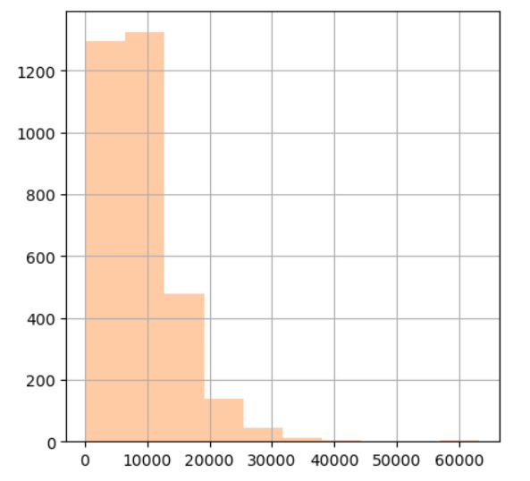
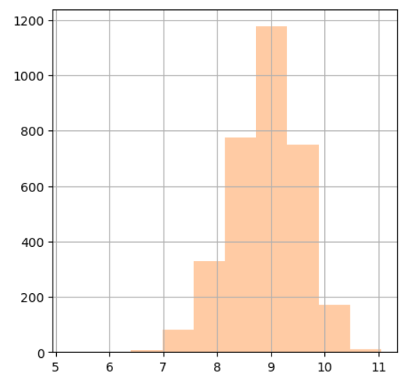
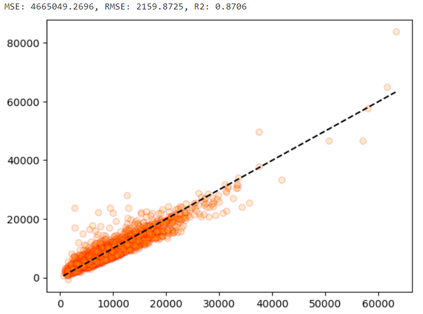
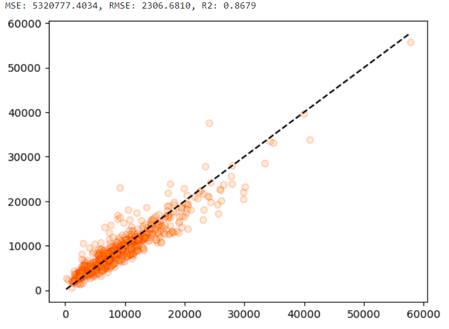
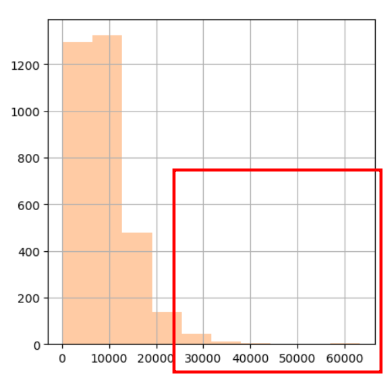
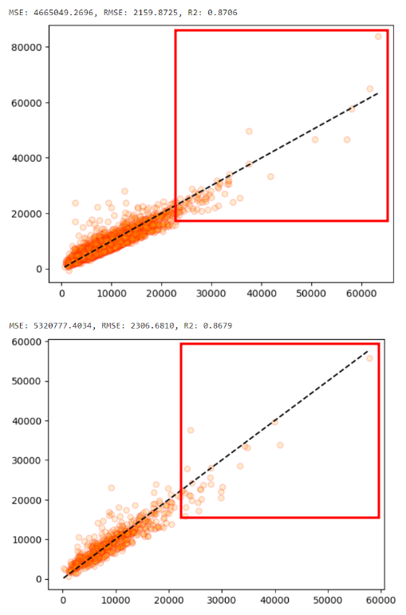

# **미국의 주거용 건물 에너지 소비 데이터**

> feature :759개  
> target (**KWH**): 건물이나 시설의 전기 사용량(Kilowatt-hour)

## **📌목차**

1. 데이터 확인 및 전처리

2. 수치형 피처 분석

    - 차원축소

3. 범주형을 합한 피처 분석

    - 차원축소
    - 파이프라인을 통한 학습

4. 타겟 분포를 변환 후 분석

    - 타겟 피처를 로그 변환
    - 차원축소 및 파이프라인을 통한 학습

5. 이상치 제거

    - 정규화 전과 후 비교

6. 과적합 확인 및 성능 분석

## **📊 데이터 전처리**

데이터의 중복행은 존재하지 않았으며, 결측치는 2382개로 제거하였습니다.  
인덱스 컬럼인 `DOEID` 를 제거하였습니다.

문자형 데이터를 확인한 결과 `METROMICRO`,`UATYP10`, `CLIMATE_REGION_PUB`, `IECC_CLIMATE_PUB` 컬럼이 해당되었습니다.  
해당 컬럼을 제외한 수치형 컬럼으로 데이터 프레임을 생성하여 1Cycle을 진행하였습니다.

해당 컬럼은 `KMH`로 타겟 데이터로 지정 후 히스토그램을 통해 분포를 확인해보았습니다.  

## **📊 1Cycle 결과**

#### 전처리를 하지 않은 데이터를 LinearRegression 를 통해 학습해봅니다.

> MSE: 0.0001, RMSE: 0.0076, R2: 1.0000

         R2값이 1.0으로 과적합의 위험성이 높다고 볼 수 있습니다
         OLS, VIF, corr 확인 결과 다중공선성이 존재하나 피처의 개수가 많아 해소가 어려웠습니다.

#### 차원축소를 진행해봅니다.

        n_components 를 5로 설정하였을 때 보존율이 가장 적당하였습니다.
        보존율: 0.595009386196383

#### PCA를 5차원으로 설정한 후 차원축소하여 학습해봅니다.

LinearRegression

> MSE: 3874387.9403, RMSE: 1968.3465, MSLE: 0.0627, RMSLE: 0.2504, R2: 0.9018

## **📊 2Cycle 결과**

#### 범주형 데이터를 포함한 후 차원축소하여 학습해봅니다.

`METROMICRO`,`UATYP10`, `CLIMATE_REGION_PUB`, `IECC_CLIMATE_PUB` 의 문자열 데이터를 LabelEncoder를 사용하여 정수로 변환하였습니다.

파이프라인을 통해 1Cycle 과 같이 5차원으로 차원축소 후 LinearRegression 모델로 학습합니다.

> MSE: 4814987.9522, RMSE: 2194.3081, R2: 0.8606

         성능이 나쁘지 않으므로 범주형 데이터를 합산하여 분석하도록 합니다.

## **📊 3Cycle 결과**

#### 타겟의 분포를 로그 변환을 통해 조정합니다.

> MSE: 0.1128, RMSE: 0.3358, MSLE: 0.0012, RMSLE: 0.0346, R2: 0.7344

         R2 값이 하락하여 분포를 조정하지 않은 데이터를 사용하도록 합니다.

## **📊 4Cycle 결과**

#### 모델의 일반화를 위해 이상치를 제거한 후 학습해봅니다.

타겟 데이터를 제외한 후 StandardScaler 를 사용하여 정규화 하고 이상치를 제거합니다.
총 3279 개의 행을 남기고 삭제합니다.

이상치 제거 전 LinearRegression 모델

> MSE: 0.1128, RMSE: 0.3358, MSLE: 0.0012, RMSLE: 0.0346, R2: 0.7344

이상치 제거 후 LinearRegression 모델

> MSE: 5320776.4443, RMSE: 2306.6808, MSLE: 0.0873, RMSLE: 0.2954, R2: 0.8679

         이상치를 제거한 후 데이터를 학습했을 때 결과가 더 좋습니다.
         파이프라인에 정규화를 할 수 있는 StandardScaler를 포함하여 학습해보기로 합니다.

#### 정규화 전과 후를 비교하여 성능을 분석해봅니다.

정규화 전 LinearRegression 모델

> MSE: 5320776.4443, RMSE: 2306.6808, MSLE: 0.0873, RMSLE: 0.2954, R2: 0.8679

정규화 후 LinearRegression 모델

> MSE: 21777472.3582, RMSE: 4666.6339, R2: 0.4594

         정규화를 하지 않은 모델의 성능이 더 좋으므로 StandardScaler를 제거한 후 모델을 사용하기로 합니다.

#### 과적합 여부를 시각화하여 확인하고 규제 적용 여부를 판단해봅니다.

> 훈련 결과 R2: 0.8706  
> 실제 예측 R2: 0.8679

        훈련 결과와 실제 예측 결과가 거의 비슷한 양상을 보이며 수치도 차이가 나지 않아 과적합이 발생하지 않았다고 할 수 있습니다.
        5차원으로 차원축소한 LinearRegression 모델이 원본 데이터를 잘 보존하면서 성능이 좋은 모델이라고 할 수 있습니다.

### 보완할 점

         타겟의 로그를 변환하지 않은 데이터로 학습한 결과 데이터가 튀는 부분을 발견할 수 있었습니다.
         로그를 변환하여 정규분포에 가깝도록 분포 조정을 하면 해소되는 부분으로 로그를 변환한 데이터를 사용하여 진행하도록 합니다.
